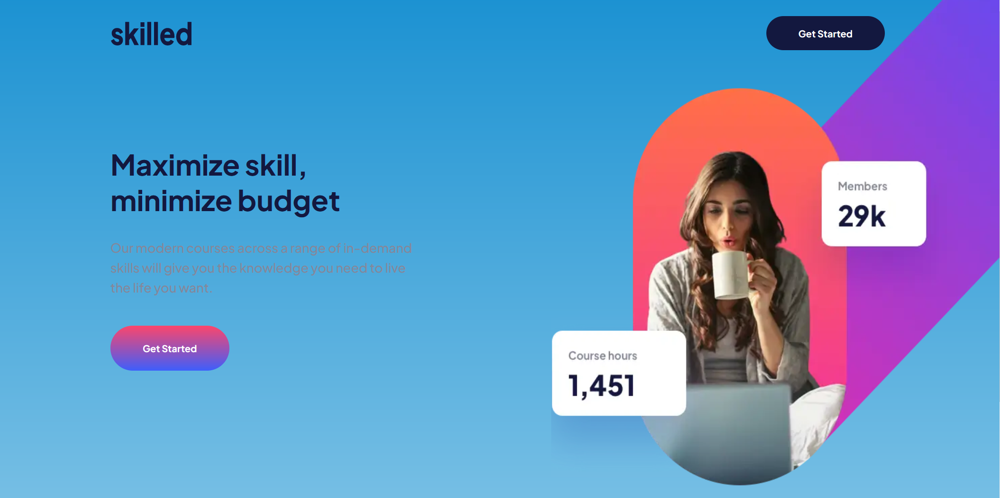
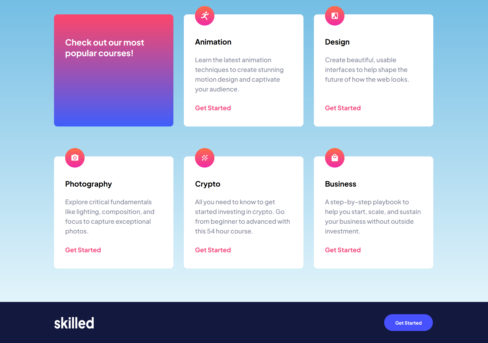

# Frontend Mentor - Skilled e-learning landing page solution

This is a solution to the [Skilled e-learning landing page challenge on Frontend Mentor](https://www.frontendmentor.io/challenges/skilled-elearning-landing-page-S1ObDrZ8q). Frontend Mentor challenges help you improve your coding skills by building realistic projects.

## Table of contents

- [Overview](#overview)
  - [The challenge](#the-challenge)
  - [Screenshot](#screenshot)
  - [Links](#links)
- [My process](#my-process)
  - [Built with](#built-with)
  - [What I learned](#what-i-learned)
  - [Continued development](#continued-development)
- [Author](#author)

## Overview

### The challenge

Users should be able to:

- View the optimal layout depending on their device's screen size
- See hover states for interactive elements

### Screenshot




### Links

- Solution URL: [Add solution URL here]()
- Live Site URL: [Add live site URL here](https://christ-kevin.github.io/skilled-elearning-landing-page/)

## My process

### Built with

- Semantic HTML5 markup
- CSS custom properties
- Flexbox
- Mobile-first workflow

### What I learned

```html
<figure>
  <picture class="hero">
    <source
      media="(min-width: 47.9em) and (max-width: 64.9em)"
      srcset="./assets/image-hero-tablet.webp 695w"
    />
    <source
      media="(min-width: 65em)"
      srcset="./assets/image-hero-desktop.webp 1046w"
    />
    
  </picture>
</figure>
```

### Continued development

- Accessibility HTML
- Semantic HTML5 markup
- Grid layouts
- CSS architecture
- DOM manipulation

## Author

- Website - [LinkedIn](https://www.linkedin.com/in/christ-k%C3%A9vin-touga-watat-32026712a/)
- Frontend Mentor - [@Christ-Kevin](https://www.frontendmentor.io/profile/Christ-Kevin)
